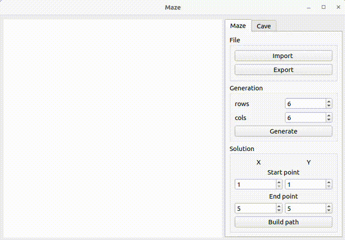

# Maze Project


## Описание проекта

Проект "Maze" представляет собой программу разработанную на C++, предназначенную для генерации, отрисовки и решения лабиринтов и пещер. В проекте используются алгоритмы клеточных автоматов и Эллера, а также графический пользовательский интерфейс для взаимодействия с пользователем.


## Пример работы программы




## Алгоритм генерации идеального лабиринта

Алгоритм генерации идеального лабиринта с использованием метода Эллера включает следующие шаги:
- Инициализация:
  - Создать двумерный массив клеток.
  - Присвоить каждой клетке уникальный набор.

- Обработка строк (кроме последней):
  - Вертикальные соединения:
    - Соединять случайные клетки вертикально с клетками в следующей строке.
  - Горизонтальные соединения:
    - Объединять случайные соседние клетки горизонтально, чтобы каждая группа имела хотя бы одно соединение.
  - Обновление наборов:
    - Присвоить новые уникальные наборы для клеток, не соединенных вертикально.

- Последняя строка:
  - Соединить все клетки горизонтально, чтобы каждая клетка была частью одного набора.


## Описание алгоритма генерации пещер

Для создания пещер используются алгоритм клеточного автомата. Алгоритм включает следующие этапы:
- Инициализация:
  - Создание двумерного массива клеток.
  - Случайное заполнение клеток: каждая клетка инициализируется как "живая" (проходимая) или "мертвая" (непроходимая) с заданной вероятностью.

- Обновление состояния:
  - Подсчет соседей: для каждой клетки подсчитывается количество соседних "живых" клеток.
  - Применение правил обновления:
    - Выживание: "Живая" клетка остается "живой", если она окружена достаточным количеством "живых" клеток (больше или равно пределу "выживания").
    - Рождение: "Мертвая" клетка становится "живой", если она окружена достаточным количеством "живых" клеток (больше или равно пределу "рождения").

Повторение шагов обновления продолжается до достижения стабильного состояния или заданного числа итераций.


## Описание форматов хранения лабиринта и пещеры в файле

**Формата хранения лабиринта**:
Лабиринт хранится в файле, который содержит количество строк и столбцов, а также две матрицы с положением вертикальных и горизонтальных стен.

Пример файла:
```
4 4
0 0 0 1
1 0 1 1
0 1 0 1
0 0 0 1

1 0 1 0
0 0 1 0
1 1 0 1
1 1 1 1
```

**Формата хранения пещеры**:
Пещера хранится в файле в виде количества строк и столбцов, а также матрицы, содержащей положение "живых" и "мертвых" клеток (0 - "мертвая" клетка, 1 - "живая" клетка).
Пример файла:
```
4 4
0 1 0 1
1 0 0 1
0 1 0 0
0 0 1 1
```


## Функциональные возможности

Программа поддерживает следующие функции:
- создание идеального лабиринта (без изолированных областей и петель):
  - задание размеров лабиринта (максимальный размер лабиринта — 50x50)
  - отрисовка лабиринта
  - возможность указать начальную и конечную точки решения лабиринта
  - отображение решения лабиринта с помощью линии, проходящей через середины ячеек
  - загрузка лабиринта из файла
  - сохранение лабиринта в файл
- генерация пещеры с использованием клеточного автомата:
  - случайная начальной конфигурации генерация пещеры
  - задание пределов "рождения" и "смерти" клеток
  - пошаговая отрисовка работы алгоритма клеточного автомата.
  - автоматическая отрисовка с заданной частотой.
  - загрузка начальной конфигурации пещеры из файла
  - сохранение начальной конфигурации пещеры в файл


## Сборка и установка

Для сборки и установки программы используется Makefile со стандартным набором целей для GNU-программ:
  - **all** - сборка и установка проекта.
  - **dvi** - открытие файла документации.
  - **install** - сборка проекта.
  - **uninstall** - удаление собранных файлов.
  - **tests** - сборка и запуск тестов.
  - **clean_tests** - очистка тестовых файлов.
  - **clean** - очистка скомпилированных файлов и отчетов.
  - **autoformat** - автоформатирование исходного кода с использованием clang-format.
  - **dist** - создание дистрибутива проекта.
  - **leaks** - запуск тестов с проверкой утечек памяти.

### Установка проекта
Для установки проекта выполните следующую команду:
    `make install`
Эта команда создаст каталог build и скомпилирует проект с использованием qmake и make. Исполняемый файл будет перемещен в каталог build.

### Запуск проекта
После установки вы можете запустить проект, выполнив команду `./build/source/Maze` или кликнув по файлу *Maze* в директории *build*.

После завершения установки вы можете запустить проект одним из следующих способов:
  - выполните команду в терминале `./build/source/Maze`
  - либо откройте каталог *build/source* и дважды щелкните по файлу *Maze*.
